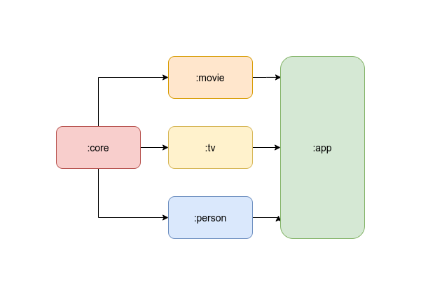
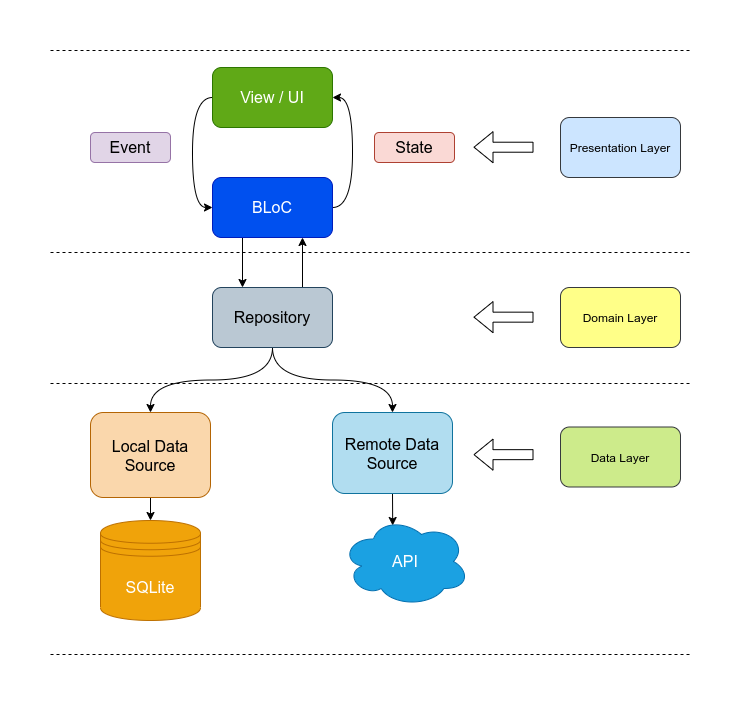

# Movie App Flutter

## App Module Structure 🧬

This app use modularization to isolates data transmission for each feature. See this [video](https://youtu.be/PZBg5DIzNww?t=281) how Florina explain about modlarization.
<br></br>
<p align="center">
  
</p>

Each feature module is implement clean architecture that contains three layers : **Data Layer**, **Domain Layer**, **Presentation Layer**

<p align="center">
  
</p>

<br></br>

## Library used 🛠

- [Dio](https://pub.dev/packages/dio) - A type-safe HTTP client.
- [Moor](https://pub.dev/packages/moor_flutter) - Moor is a reactive persistence library for Flutter and Dart, built ontop of sqlite.
- [Kiwi](https://pub.dev/packages/kiwi) - A Dependency Injection
- [BLoC](https://pub.dev/packages/flutter_bloc) -  Business logic component to separate the business logic with UI.
- [Dartz](https://pub.dev/packages/dartz) - Functional programming in Dart
- [Flutter Config](https://pub.dev/packages/flutter_config) - Plugin that exposes environment variables to your Dart code in Flutter as well as to your native code in iOS and Android.
- [Logger](https://pub.dev/packages/logger) - Small, easy to use and extensible logger


## Quick Start 💻

1. Before run this project makesure you have `.env` in root project directory. If not you can create `.env` then write this setup enviroment :

```
API_GATWAY=https://api.themoviedb.org/3/
TMDB_SECRET_KEY=SECRET TOKEN FROM TMDB
```

2. Sync all dependencies with `./syncdeps.sh`
```
$ sudo chmod 774 syncdeps.sh 
$ ./syncdeps.sh
```