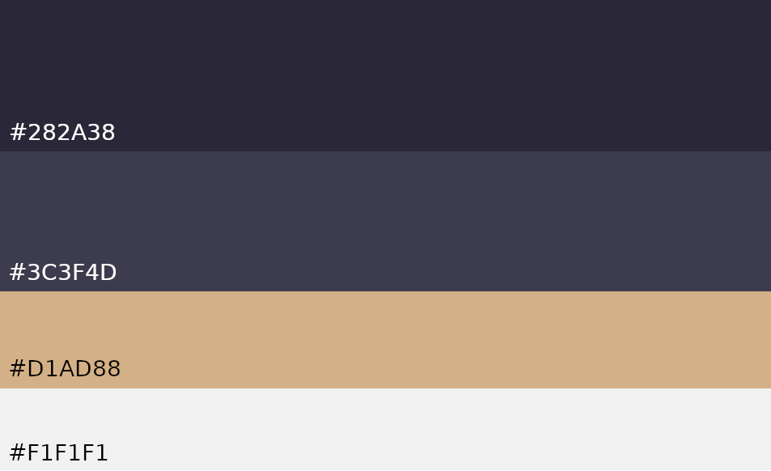

# Movie App Flutter
[](https://app.bitrise.io/app/7397ae0265733cea)

## App Module Structure 🧬

This app use modularization to isolates data transmission for each feature. See this [video](https://youtu.be/PZBg5DIzNww?t=281) how Florina explain about modlarization.
<p align="center">
  
</p>

Each feature module contains three layers : **Data Layer**, **Domain Layer**, **Presentation Layer**

<p align="center">
  
</p>
<br></br>

## Library used 🛠

- [Dio](https://pub.dev/packages/dio) - A type-safe HTTP client.
- [Moor](https://pub.dev/packages/moor_flutter) - Moor is a reactive persistence library for Flutter and Dart, built ontop of sqlite.
- [Flutter Secure Storage](https://pub.dev/packages/flutter_secure_storage) - A Flutter plugin to store data in secure storage
- [Kiwi](https://pub.dev/packages/kiwi) - A Dependency Injection
- [BLoC](https://pub.dev/packages/flutter_bloc) -  Business logic component to separate the business logic with UI.
- [Dartz](https://pub.dev/packages/dartz) - Functional programming in Dart
- [Flutter Config](https://pub.dev/packages/flutter_config) - Plugin that exposes environment variables to your Dart code in Flutter as well as to your native code in iOS and Android.
- [Logger](https://pub.dev/packages/logger) - Small, easy to use and extensible logger
- [Lottie](https://pub.dev/packages/lottie) - An Android and iOS library that parses Adobe After Effects annimations exported as json with Bodymovin and renders them natively on mobile!


## Quick Start 💻

1. Before run this project makesure you have `.env` in root project directory. If not you can create `.env` then write this setup enviroment :

```
API_GATWAY=https://api.themoviedb.org/3/
TMDB_SECRET_KEY=SECRET TOKEN FROM TMDB
```

2. Sync all dependencies with `./syncdeps.sh`
```
$ sudo chmod 774 syncdeps.sh 
$ ./syncdeps.sh
```

3. Generate dart code with `./generate-as-build.sh`
```
$ sudo chmod 774 generate-as-build.sh 
$ ./generate-as-build.sh
```

4. If you want to clear all generate code, you can use `./clean-generate-code.sh`
```
$ sudo chmod 774 clean-generate-code.sh 
$ ./clean-generate-code.sh
```

## App Design 🎨

1. UI/UX References
    - [Kinema Mobile App](https://www.behance.net/gallery/105169187/Kinema-Online-Movies-App-Concept-for-IOS)
    - [Netflix](https://www.behance.net/gallery/109813137/NETFLIX-APP?tracking_source=search_projects_recommended%7Cnetflix%20mobile%20app)
<br></br>
2. Color Palette
<p align="center">
  
</p>
<br></br>

## Todo 📃

- [ ] Authentication
    - [ ] Signin with apple
    - [ ] Signin with google
- [ ] Homepage
- [ ] Discover tv show
    - [ ] List of tv show
    - [ ] Detail tv show
- [ ] Discover movie
    - [ ] List of discover movie
    - [ ] Detail movie
- [ ] Genre
    - [ ] List of genre
    - [ ] Movie by genre selected
    - [ ] Tv show by genre selected
- [ ] Upcoming movie
- [ ] Favorite movie or tv show
- [ ] Search movie or tv show
- [ ] User profile